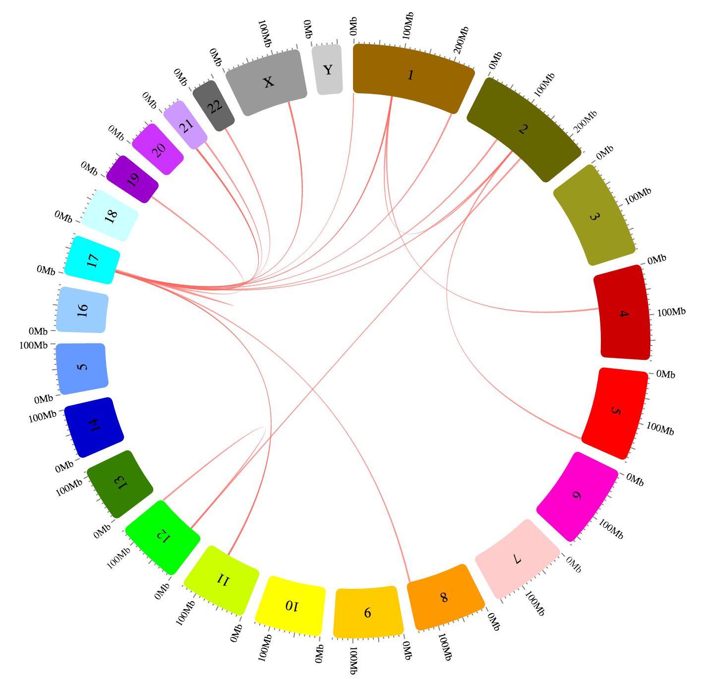

*Gene fusions in human karyotype [source](http://cancer.sanger.ac.uk/cosmic/download)*

**index.html**

```html
<!DOCTYPE html>
<html>

  <head>
    <script src='https://cdn.rawgit.com/nicgirault/circosJS/v2/dist/circos.js'></script>
    <script src='https://cdnjs.cloudflare.com/ajax/libs/d3-queue/3.0.3/d3-queue.js'></script>
  </head>

  <body>
    <svg id='chart'></svg>

    <script>
      var circos = new Circos({
        container: '#chart'
      });
      var drawCircos = function(error, GRCh37, rawData) {

        data = rawData.map(function(d){
          return [
            d.source_id,
            parseInt(d.source_breakpoint) - 2000000,
            parseInt(d.source_breakpoint) + 2000000,
            d.target_id,
            parseInt(d.target_breakpoint) - 2000000,
            parseInt(d.target_breakpoint) + 2000000,
          ];
        });

        circos
          .layout(
            {
              ticks: {display: true},
            },
            GRCh37
          )
          .chord('gene-fusion', {color: '#fd6a62'}, data)
          .render();
      };

      queue()
        .defer(d3.json, "GRCh37.json")
        .defer(d3.csv, "fusion-genes.csv")
        .await(drawCircos);
    </script>
  </body>

</html>
```

**GRCh37.json**:

```json
[
  {"id":"chr1","label":"1","color":"#996600","len":249250621},
  {"id":"chr2","label":"2","color":"#666600","len":243199373},
  {"id":"chr3","label":"3","color":"#99991E","len":198022430},
  {"id":"chr4","label":"4","color":"#CC0000","len":191154276},
  {"id":"chr5","label":"5","color":"#FF0000","len":180915260},
  {"id":"chr6","label":"6","color":"#FF00CC","len":171115067},
  {"id":"chr7","label":"7","color":"#FFCCCC","len":159138663},
  {"id":"chr8","label":"8","color":"#FF9900","len":146364022},
  {"id":"chr9","label":"9","color":"#FFCC00","len":141213431},
  {"id":"chr10","label":"10","color":"#FFFF00","len":135534747},
  {"id":"chr11","label":"11","color":"#CCFF00","len":135006516},
  {"id":"chr12","label":"12","color":"#00FF00","len":133851895},
  {"id":"chr13","label":"13","color":"#358000","len":115169878},
  {"id":"chr14","label":"14","color":"#0000CC","len":107349540},
  {"id":"chr15","label":"5","color":"#6699FF","len":102531392},
  {"id":"chr16","label":"16","color":"#99CCFF","len":90354753},
  {"id":"chr17","label":"17","color":"#00FFFF","len":81195210},
  {"id":"chr18","label":"18","color":"#CCFFFF","len":78077248},
  {"id":"chr19","label":"19","color":"#9900CC","len":59128983},
  {"id":"chr20","label":"20","color":"#CC33FF","len":63025520},
  {"id":"chr21","label":"21","color":"#CC99FF","len":48129895},
  {"id":"chr22","label":"22","color":"#666666","len":51304566},
  {"id":"chrX","label":"X","color":"#999999","len":155270560},
  {"id":"chrY","label":"Y","color":"#CCCCCC","len":59373566}
]
```

**fusion-genes.csv**

```csv
source_id,source_breakpoint,target_id,target_breakpoint,source_label,target_label
chr19,24186054,chr17,33478117,5_8S_rRNA.4,UNC45B
chr4,76807187,chr1,91852878,AC110615.1,HFM1
chr12,34372614,chr12,127650987,AC140847.1,AC079949.1
chr12,34372616,chr2,159440784,AC140847.1,PKP4
chr2,133012108,chr5,174541752,ANKRD30BL,CTC-281M20.1
chr22,21265412,chr17,33478113,CRKL,UNC45B
chr1,91852783,chr2,133036705,HFM1,AC097532.1
chr21,9827203,chr17,33478116,MAFIP,UNC45B
chr21,9826936,chr17,33478113,MAFIP,UNC45B
chr21,9827510,chr17,33478111,MAFIP,UNC45B
chr1,568507,chr17,33478117,RP5-857K21.4,UNC45B
chr17,37360418,chr17,33478115,RPL19,UNC45B
chr17,33478116,chrX,108297810,UNC45B,RN28S1
chr17,33478131,chr8,136786084,UNC45B,U1.10
chr17,33478111,chr2,88124673,UNC45B,RGPD2
chr17,33478116,chr1,237766312,UNC45B,RYR2
chr17,33478116,chr1,91853039,UNC45B,HFM1
chr17,33478117,chr2,133012644,UNC45B,ANKRD30BL
chr17,33478115,chr11,85194786,UNC45B,DLG2
chr17,33478115,chr11,85194786,UNC45B,DLG2
chr17,33478117,chr21,35677489,UNC45B,AP000318.2
chr17,33478117,chr1,91852849,UNC45B,HFM1
chr17,33478114,chrX,108297713,UNC45B,RN28S1
```
