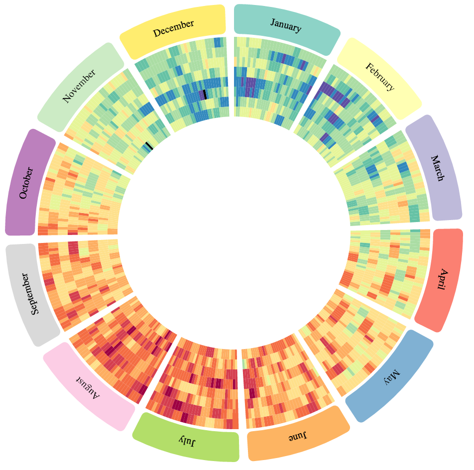
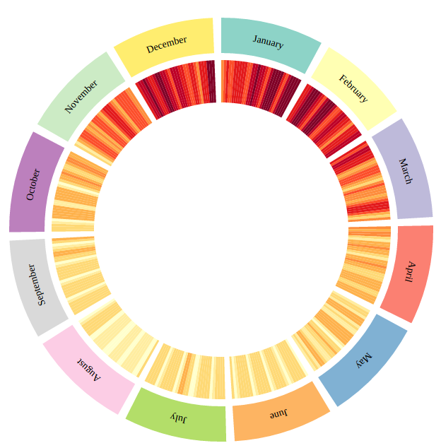
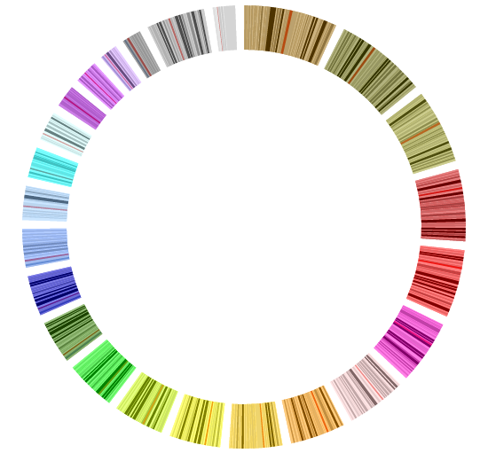
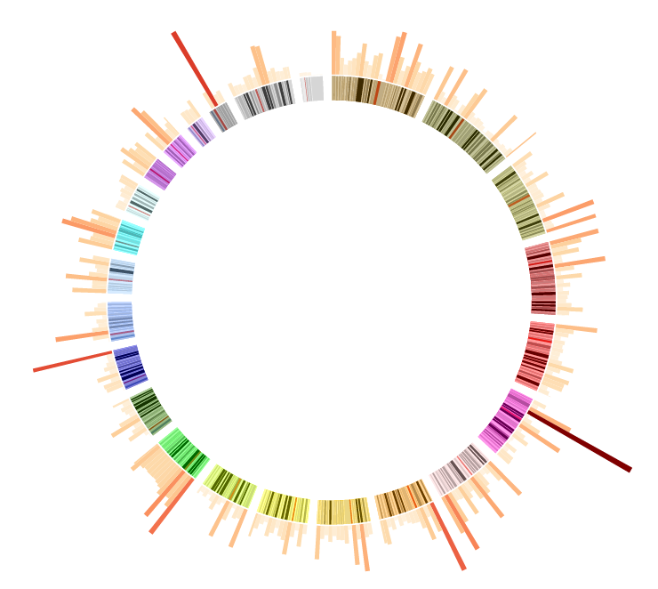
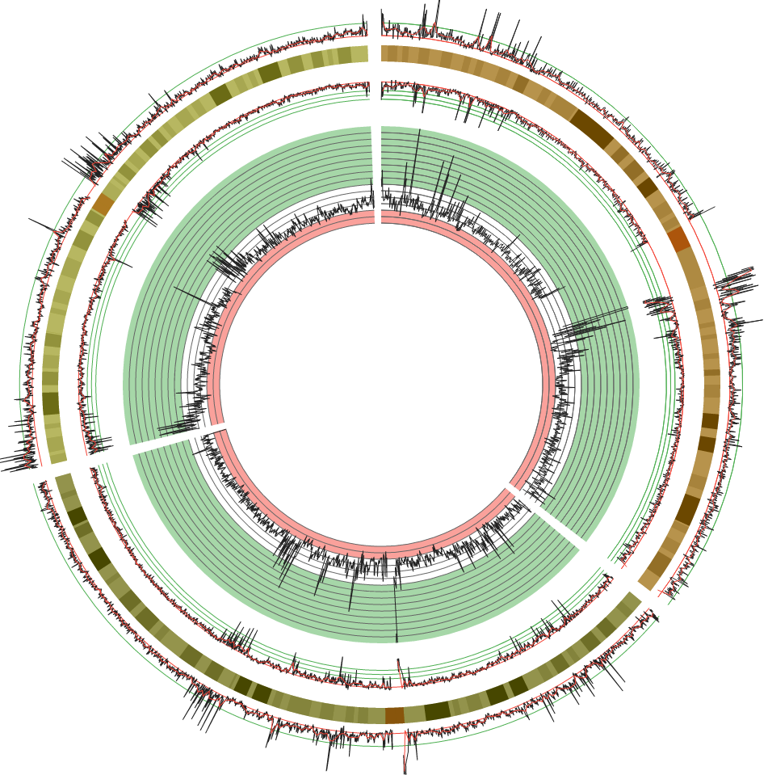
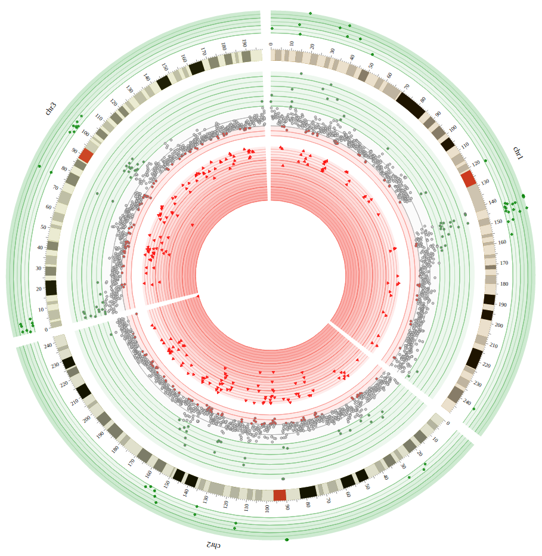
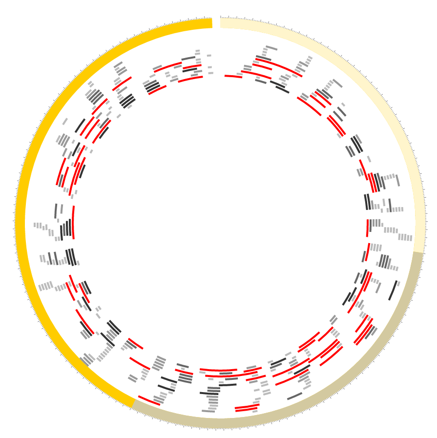
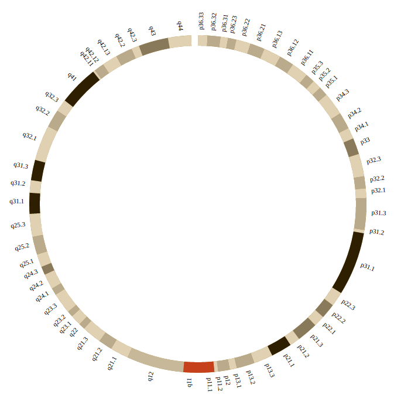
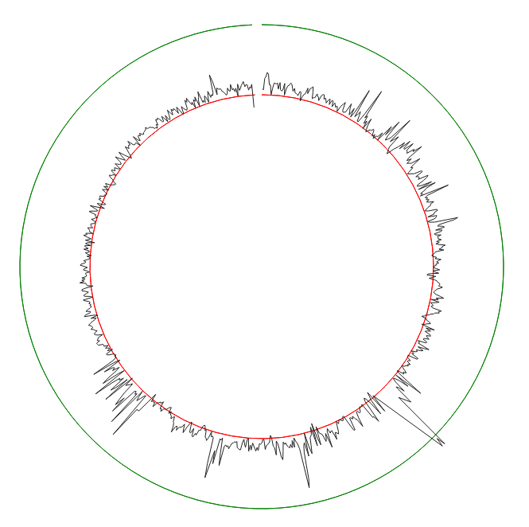
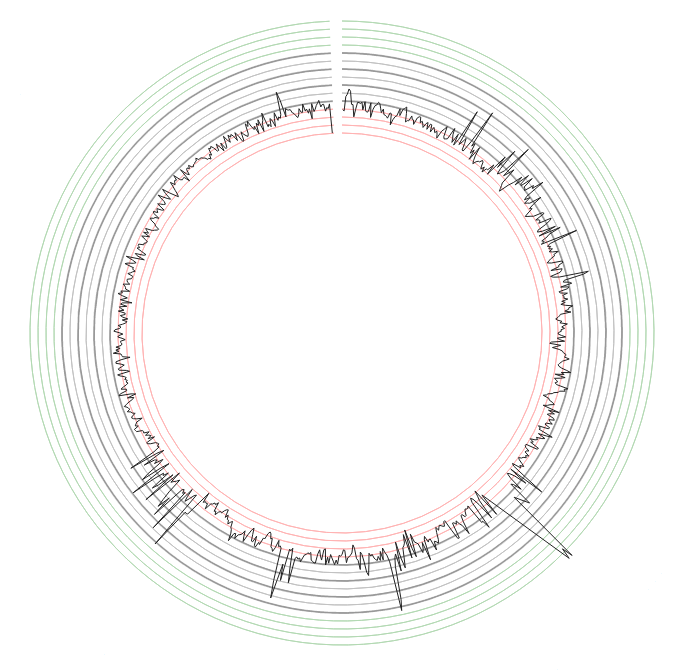

# Circos [](https://circleci.com/gh/nicgirault/circosJS) [](https://coveralls.io/github/nicgirault/circosJS?branch=master)

Demo: [nicgirault.github.io/circosJS/demo](https://nicgirault.github.io/circosJS/demo)

## table of contents

- [Introduction](#introduction)
- [Installation](#installation)
- [Layout](#layout)
- [Tracks](#tracks)
  - [Chords](#chords)
  - [Heatmap](#heatmap)
  - [Highlight](#highlight)
  - [Histogram](#histogram)
  - [Line](#line)
  - [Scatter](#scatter)
  - [Stack](#stack)
  - [Text](#text)
- [Configuration Attributes](#configurationAttributes)
  - [innerRadius](#innerRadiusOuterRadius)
  - [outerRadius](#innerRadiusOuterRadius)
  - [min](#minmax)
  - [max](#minmax)
  - [color](#color)
  - [axes](#axes)
  - [showAxesTooltip](#showAxesTooltip)

## Introduction

Circos is a javascript library to easily build interactive graphs in a circular layout. It's based on [d3.js](https://d3js.org/). It aims to be a javascript version of the [Circos](http://circos.ca) software.

You should consider using Circos to show:

- relationships between entities
- periodical data

<p align="center">
  
  <br/>
  <i>Average temperatures in Paris from 2007 (inner) to 2014 (outer). The circular layout highlights seasonal effect.</i>
</p>

## Installation

If you don't know what is yarn or npm you can skip this step and get started with [this canvas](doc/canvas.html). Otherwise:

```
yarn add circos
```

## Layout

To instantiate a new circos:

```javascript
var myCircos = new Circos({
    container: '#chart',
    width: 500,
    height: 500,
});
```

A circos graph is based on a circular axis **layout**. Data tracks appear inside and/or outside the circular layout.

In order to place data on the circos graph, you must first specify the layout.

```javascript
myCircos.layout(data, configuration);
```

The first argument of the `layout` function is a configuration object that control the format of the layout.

Here are the default parameters for a layout:

```javascript
var configuration = {
  innerRadius: 250,
  outerRadius: 300,
  cornerRadius: 10,
  gap: 0.04, // in radian
  labels: {
    display: true,
    position: 'center',
    size: '14px',
    color: '#000000',
    radialOffset: 20,
  },
  ticks: {
    display: true,
    color: 'grey',
    spacing: 10000000,
    labels: true,
    labelSpacing: 10,
    labelSuffix: 'Mb',
    labelDenominator: 1000000,
    labelDisplay0: true,
    labelSize: '10px',
    labelColor: '#000000',
    labelFont: 'default',
    majorSpacing: 5,
    size: {
      minor: 2,
      major: 5,
    }
  },
  clickCallback: null
}
```

The second argument of the `layout` function is an array of data that describe the layout regions. Each layout region must have an id and a length. You can also specify a color and a label.

```javascript
var data = [
  { len: 31, color: "#8dd3c7", label: "January", id: "january" },
  { len: 28, color: "#ffffb3", label: "February", id: "february" },
  { len: 31, color: "#bebada", label: "March", id: "march" },
  { len: 30, color: "#fb8072", label: "April", id: "april" },
  { len: 31, color: "#80b1d3", label: "May", id: "may" },
  { len: 30, color: "#fdb462", label: "June", id: "june" },
  { len: 31, color: "#b3de69", label: "July", id: "july" },
  { len: 31, color: "#fccde5", label: "August", id: "august" },
  { len: 30, color: "#d9d9d9", label: "September", id: "september" },
  { len: 31, color: "#bc80bd", label: "October", id: "october" },
  { len: 30, color: "#ccebc5", label: "November", id: "november" },
  { len: 31, color: "#ffed6f", label: "December", id: "december" }
]
```

The `id` parameter will be used to place data points on the layout.

To visualize the result:

```javascript
myCircos.render();
```


## Tracks

A track is a series of data points.

To add a track to your graph you should write something like this:

```javascript
myCircos.heatmap(
    'my-heatmap',
    data,
    {
        // your heatmap configuration (optional)
    },
);
```

This pattern is similar to all track types:

```javascript
myCircos.trackType('track-id', data, configuration);
```

**Note**: The track name is used as a HTML class name so here are the format limitations.

* Must be unique.
* Should be slug style for simplicity, consistency and compatibility. Example: `my-heatmap`
* Lowercase, a-z, can contain digits, 0-9, can contain dash or dot but not start/end with them.
* Consecutive dashes or dots not allowed.
* 50 characters or less.


### Chords

Chords tracks connect layout regions.

<p align="center">
  
  <br/>
  <i>Some gene fusions in human karyotype (<a href="demo/chords.js">source</a>)</i>
</p>

Data should looks like this:

```javascript
var data = [
    // sourceId, sourceStart, sourceEnd, targetId, targetStart, targetEnd
    ['january', 1, 12, 'april', 18, 20],
    ['february', 20, 28, 'december', 1, 13],
];
```

Optionally each datum can define a seventh element which can be used to be interpreted as a `value` to draw colored ribbons with palettes or a color function.

The default configuration is:

```javascript
{
  color: '#fd6a62',
  opacity: 0.7,
  zIndex: 1,
  tooltipContent: null,
  min: null,
  max: null,
  logScale: false,
  logScaleBase: Math.E,
}
```

### Heatmap

<p align="center">
  
  <br/>
  <i>Electrical comsumption in France in 2014</i>
</p>

To add a heatmap to your circos instance:

```javascript
myCircos.heatmap('electrical-consumption', data, configuration);
```

Configuration:

```javascript
{
  innerRadius: null,
  outerRadius: null,
  min: null,
  max: null,
  color: 'YlGnBu',
  logScale: false,
  tooltipContent: null,
}
```

Data format:

```javascript
var data = [
    // each datum should be
    // layout_block_id, start, end, value
    ['january', 0, 1, 1368001],
    ['january', 1, 2, 1458583],
    ['january', 2, 3, 1481633],
    ['january', 3, 4, 1408424]
    ...
    ['february', 0, 1, 1577419],
    ['february', 1, 2, 1509311],
    ['february', 2, 3, 1688266],
    ...
]
```

### Highlight

<p align="center">
  
  <br/>
  <i>Human karyotype with cytobands highlighted (<a href="demo/highlight.js">source</a>)</i>
</p>

To add a highlight to your circos instance:

```javascript
myCircos.highlight('cytobands', data, configuration);
```

The minimal datum should have `block_id`, `start` and `end` attributes.

Configuration:

```javascript
{
  innerRadius: null,
  outerRadius: null,
  min: null,
  max: null,
  color: 'd3d3d3',
  strokeColor: null,
  strokeWidth: 0,
  opacity: 1,
  logScale: false,
  tooltipContent: null,
}
```

### Histogram

<p align="center">
  
  <br/>
  <i>Genetic abnormalities in human stem cells (<a href="demo/histogram.js">source</a>)</i>
</p>

Data should looks like this:

```javascript
var data = [
    {
      block_id: 'january',
      start: 1,
      end: 10,
      value: 5
    }
];
```

The available configuration fields are:
- [innerRadius](#innerRadiusOuterRadius)
- [outerRadius](#innerRadiusOuterRadius)
- [color](#color)
- [opacity](#opacity)
- [zIndex](#zIndex)
- [tooltipContent](#tooltipContent)
- [min](#minmax)
- [max](#minmax)
- [logScale](#logScale)
- [logScaleBase](#logScaleBase)
- [axes](#axes)

### Line

<p align="center">
  
  <br/>
  <i>Some single nucleotide polymorphism on chromosomes 1, 2 and 3 (<a href="demo/line.js">source</a>)</i>
</p>

```javascript
myCircos.line('line1', data, configuration);
```

The minimal datum should have `block_id`, `position` and `value` attributes.

The available configuration fields are:
- [innerRadius](#innerRadiusOuterRadius)
- [outerRadius](#innerRadiusOuterRadius)
- [color](#color)
- [strokeColor](#strokeColor)
- [strokeWidth](#strokeWidth)
- [direction](#direction)
- [fill](#fill)
- [maxGap](#maxGap)
- [opacity](#opacity)
- [zIndex](#zIndex)
- [min](#minmax)
- [max](#minmax)
- [logScale](#logScale)
- [logScaleBase](#logScaleBase)
- [axes](#axes)
- [backgrounds](#backgrounds)

**Note**: The tooltip option is not available for line track. To display a tooltip, you should superimpose an invisble `scatter` track (`fill: false` and `strokeWidth: 0`) and set a tooltip for this track.

### Scatter

<p align="center">
  
  <br/>
  <i><a href="demo/line.js">source</a></i>
</p>

```javascript
myCircos.scatter('scatter1', data, configuration);
```

The minimal datum should have `block_id`, `position` and `value` attributes.

The available configuration fields are:
- [innerRadius](#innerRadiusOuterRadius)
- [outerRadius](#innerRadiusOuterRadius)
- [color](#color)
- [strokeColor](#strokeColor)
- [strokeWidth](#strokeWidth)
- [direction](#direction)
- [fill](#fill)
- [size](#size)
- [shape](#shape)
- [opacity](#opacity)
- [zIndex](#zIndex)
- [min](#minmax)
- [max](#minmax)
- [logScale](#logScale)
- [logScaleBase](#logScaleBase)
- [axes](#axes)
- [backgrounds](#backgrounds)

### Stack

<p align="center">
  
  <br/>
  <i><a href="demo/stack.js">source</a></i>
</p>

```javascript
myCircos.stack('stack', data, configuration);
```

The minimal datum should have `block_id`, `start` and `end` attributes.

Configuration:

```javascript
{
  innerRadius: null,
  outerRadius: null,
  min: null,
  max: null,
  color: '#fd6a62',
  strokeColor: '#d3d3d3',
  strokeWidth: 1,
  direction: 'out',
  thickness: 10,
  radialMargin: 2,
  margin: 2,
  opacity: 1,
  logScale: false,
  tooltipContent: null,
}
```

### Text

<p align="center">
  
  <br/>
  <i><a href="demo/text.js">source</a></i>
</p>

```javascript
myCircos.text('text', data, configuration);
```

The minimal datum should have `block_id`, `position` and `value` attributes.

Configuration:

```javascript
{
  innerRadius: null,
  outerRadius: null,
  style: {
    'font-size': 12,
    color: 'black',
  },
  opacity: 1,
}
```

## Configuration Attributes

### backgrounds

You can add a list of backgrounds:

```javascript
{
  backgrounds: [
    {
      start: 0.006,
      color: '#4caf50',
      opacity: 0.1
    },
    {
      start: 0.002,
      end: 0.006,
      color: '#d3d3d3',
      opacity: 0.1
    },
    {
      end: 0.002,
      color: '#f44336',
      opacity: 0.1
    }
  ]
}
```

The `start` and `end` fields are interpreted as values on the same scale than the track values.
- If `start` is not specified, default is the `min` value of the track.
- If `end` is not specified, default is the `max` value of the track.

You can also specify a `color` and an `opacity`.

### innerRadius/outerRadius

For the layout, the innerRadius and outerRadius values are always interpreted as a number of pixel.

For tracks:

If innerRadius and outerRadius are between `0` and `1`, the value is interpreted as a fraction of the innerRadius of the layout.

eg:
```
{
  innerRadius: 0.5,
  outerRadius: 0.8
}
```

If innerRadius and outerRadius are between `1` and `10`, the value is interpreted as a fraction of the outerRadius of the layout.

eg:
```
{
  innerRadius: 1,
  outerRadius: 1.2
}
```

Otherwise it is interpreted as a number of pixels.

### min/max

The default min and max values are computed according to the dataset. You can override these values by specifying a `min` or `max` attribute in the configuration.

### color

The color attribute can be either:

#### CSS color code

e.g `#d3d3d3`, `blue`, `rgb(0, 0, 0)`

#### Palette name from [d3-scale-chromatic](https://github.com/d3/d3-scale-chromatic)

The color will be computed dynamically according to the track data `value` field.

If you prefix the palette name with a `-` (e.g `-BrBG`), the palette will be reversed.

The list of palette names are:

**BrBG**:

**PRGn**:

**PiYG**:

**PuOr**:

**RdBu**:

**RdGy**:

**RdYlBu**:

**RdYlGn**:

**Spectral**:

**Blues**:

**Greens**:

**Greys**:

**Oranges**:

**Purples**:

**Reds**:

**BuGn**:

**BuPu**:

**GnBu**:

**OrRd**:

**PuBuGn**:

**PuBu**:

**PuRd**:

**RdPu**:

**YlGnBu**:

**YlGn**:

**YlOrBr**:

**YlOrRd**:


#### Custom function

You can specify a function that compute the color code given the track data and the datum index. For example:

```javascript
{
  color: function(datum, index) {
    return datum.value < 5 ? 'red' : 'green'
  }
}

```

### axes

The default value is an empty array:

```javascript
{
  axes: []
}
```

You can add items to this array to render an axis or a group of axes. You can give axes a `color` (default: '#d3d3d3'), `thickness` (default: 1) and `opacity` (default: track opacity):

```javascript
{
  axes: [
    {
      color: 'black',
      thickness: 2, // in pixel
      opacity: 0.3 // between 0 and 1
    }
  ]
}
```

Then you should specify where to place the axes.

You can either define a single axis by defining a `position` attribute with a value between the min and max value of the track:

```javascript
{
  axes: [
    {
      color: 'red',
      position: 4
    },
    {
      color: 'green',
      position: 15
    }
  ]
}
```

<p align="center">
  
  <br/>
  <i><a href="demo/axes">source</a></i>
</p>


Or define a range of axes with a `spacing` attribute and optionnally a `start` and `end` attributes:

```javascript
{
  axes: [
    {
      spacing: 2
    }
  ]
}
```

<p align="center">
  
  <br/>
  <i><a href="demo/axes">source</a></i>
</p>

Here is an advanced example:

```javascript
{
  axes: [
    {
      color: 'red',
      spacing: 2,
      end: 4
    },
    {
      color: 'green',
      spacing: 2,
      start: 16
    },
    {
      spacing: 2,
      start: 4,
      end: 16,
      thickness: 2
    },
    {
      spacing: 1,
      start: 4,
      end: 16,
      thickness: 1
    }
  ]
}
```

<p align="center">
  
  <br/>
  <i><a href="demo/axes">source</a></i>
</p>

The values that you set for `position`, `spacing`, `start` and `end` are in the unit of the track values.

### tooltipContent

A function that receive the datum and the index as a value and return a string displayed in the tooltip (HTML is accepted):

```javascript
{
  tooltipContent: function (datum, index) {
    return `<h5>${datum.block_id}:${datum.start}-${datum.end} ➤ ${datum.value}</h5> <i>(CTRL+C to copy to clipboard)</i>`
  }
}
```

Then when you mouseover the datum, a tooltip will be displayed.
Note that you can use the keyboard shortcut CTRL+C to copy the content to clipboard.

### showAxesTooltip

Show or not a tooltip with the value of the axis. Default is `true`.

### direction

It should be either `in` or `out`. Default is `out`. For stack you can also use `center`.

### fill

`true` or `false`.

### logScale

`true` or `false`. Default is `false`.

### logScaleBase

The log base if logScale is `true`. Default is `Math.E`.

### shape

It should be one of:
  - `circle`
  - `cross`
  - `diamond`
  - `square`
  - `triangle`
  - `star`
  - `wye`

### zIndex

This should be an integer. The higher it is the more above the track will appear.

## Contact

Nicolas Girault
nic.girault@gmail.com

Your feedbacks are welcome. If you're struggling using the librairy, the best way to ask questions is to use the Github issues so that they are shared with everybody.
